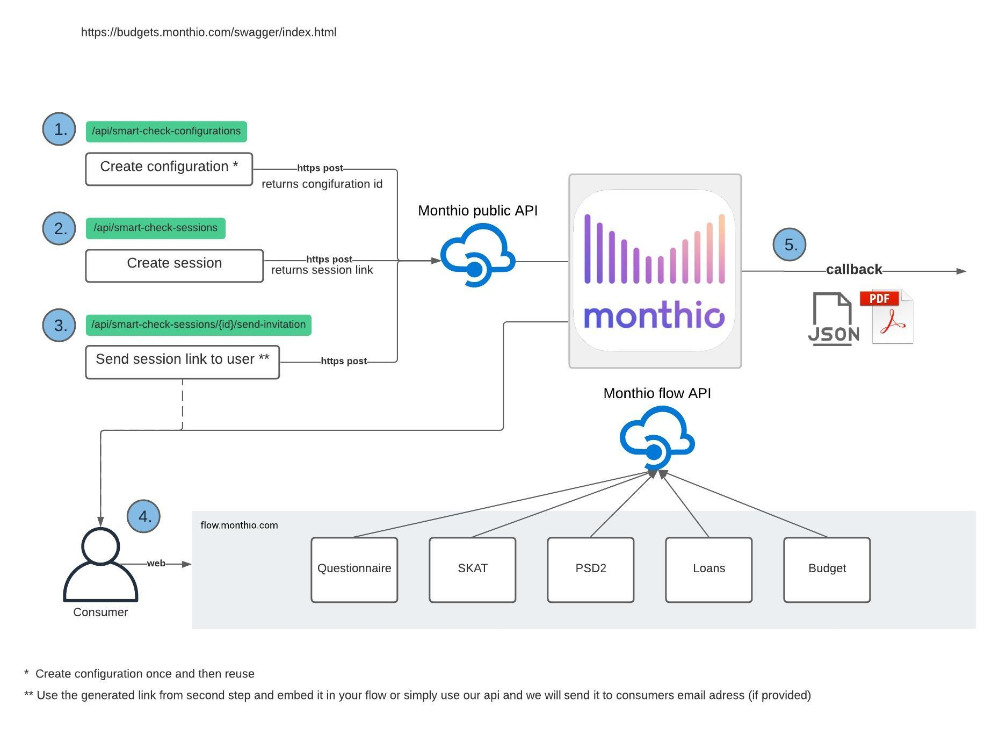

# IntegrationExamples
Collection of examples that illustrate how to integrate with Monthio public API

Here is a high overview flow diagram which exmplains how does Monthio system works.

1. Create configuration that defines how most of the settings should work. (Callback url, pdf output, redirect url, which modules are enabled, etc.). This needs to be done only once per different configuration. THey should be reused.
2. Create session based on a configuration created in previous step. This endpoint will return a session id that can be used to create a link for consumer. 
3. Deliver the link to the consumer by either sending it or redirecting them in your own flow. You can also use iframe but we would not recommend it as a lot of browser features might be disabled on consumers device when accessing third party iframes.
4. Now consumer would go thru Monthio flow, flow depends on configuration settings specified in first step.
5. After consumer finished the flow successfully Monthio will send the data to your system based on the configuration settings specified in first step.
